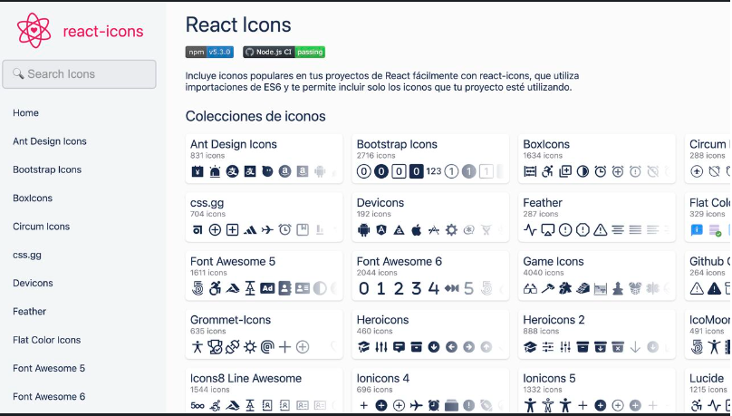

# Indice

- [Hook useRef](#hook-useref)
- [Manejo de formularios](#manejo-de-formularios)
- [Iconos react](#iconos-react)
- [Inicializar proyecto npm/vite-react](#como-crear-un-proyecto-en-reac-con-vite)
- [Que es una componente](#que-es-una-componente-react)
- [Que es un elemento](#que-es-un-elemento-react)
- [Tips](#tips)
    - [nombramiento de clases](#nombramiento-de-clases)
    - [evaluar expresiones](#evaluar-expresiones)
    - [render en el punto de entrada](#renderizar-mas-de-un-elemento-en-el-punto-de-entrada)
    - [bolenos por parámetro](#boleanos-por-parámetro)
    - [funcion por parámetro](#pasando-una-función-como-parámetro)

## Hook useRef

1. Es un hook que nos permite crear una referencia mutable  
2. Persiste durante todo el ciclo de vida del componente  
3. Util para guardar cualquier valor que se pueda muta: id, DOM element, contador etc  
4. Cada vez que un elemento referenciado cambia NO vuelve a renderizar el componente (lo que lo diferencia de useState)  
5. Uso más típico es referenciar elementos del DOM  
6. Si se necesitan referenciar demasiados elementos del DOM es mejor hacerlo con el objeto FormData del evento del formulario con javascript puro.

APP:

    import { useRef } from 'react';

    export function App () {
    const inputRef = useRef();

    const handleClick = () => {
        // siempre se debe acceder a la propiedad "current" de la referencia, que es donde esta el input
        // esto lo hace react por que es un objeto mutable
        const value = inputRef.current.value
        console.log(value);
    }
        return (
            <button onClick={handleClick}> </button>
        )
    }

## Manejo de formularios

Para extraer datos de un formulario diligenciado podemos hacerlo de dos maneras con react:

1. Forma no controlada:
```
    function handleSubmit (event) {
        const fields = New window.FormData(event.target);
        const inputValue = fields.get('inputName')
    }
```
HTML:

    <form class='form' onSubmit='handleSubmit'>
        <input name='inputName' placeholder='wherever'/>
        <button type='submit'>accept</button>
    </form>

Se dice "forma no controlada" por que React no es quien se está encargando de controlar lo que sucede
con el formulario, en este caso lo estamos haciendo con javascript.

2. Forma controlada:
```
    import { useRef } from 'react';
    function App() {
        const inputRef = useRef();

        const handleSubmit =  (event) =>{
            event.preventDefault();
            const inputValue = inputRef.current.value;
        }
        return (
        <form onSubmit={handleSubmit}>
            <input ref={inputRef} type="text" placeholder='Search movie'/>
            <button type='submit' >Search</button>
        </form>
        )
    }
```

## Iconos react

Libreria de iconos para react

    $ npm install react-icons



## Como crear un proyecto en reac con vite

1. Inicializar un proyecto __npm__

    npm init -y

2. Inicializar un proyecto con vite:

    npm create vite@latest

Se escogen las opciones que son de nuestro interés por ejemplo, vite-react, javascript o  
typescript y jsx

3. entrar en la ruta del proyecto e installar las dependecias  

    npm install

## ¿Que es una componente react?

Es una función o clase que devuelve un elemento, puede aceptar entradas (props)  

ejemplo:

    export function App() {
        return (
            <article>
                <header>
                </header>
                <aside>
                </aside>
            </article>
        )
    }

## ¿Que es un elemento react?

Es el bloque más pequeño de la composición de una interfaaz, es inmutable lo que  
quiere decir que no cambia después de su creación

## Tips

### nombramiento de clases

Las clases en jsx (que es el hibrido entre html y javascript que usa react) deben ser escritas  de la siguiente manera:  

    <article className="class-name"></article>

Esto es debido a que "class" es una palabra reservada de HTML

### evaluar expresiones

    src={`http//www.icon/${var}`}

Se usan corchetes para señalar a react que lo de dentro es una expresión que debe ser  
evaluada, también se usan los __string template__ para poder incluir una variable en ese  
string

### renderizar mas de un elemento en el punto de entrada

    <React.Fragment>
        <Element1 />
        <Element2 />
    </React.Fragment>

También funciona sin la palabra reservada "React.Fragment" si se pone vacio o un elemento  
de tipo contenedor:

    <>
        <Element1/>
        <Element2/>
    </>
    <div>
        <Element1 />
        <Element2 />
    </div>


### boleanos por parámetro

    <Component varBoolean='{true}' />

es igual que si escribimos:

    <Component varBoolean />

debido a que el valor por defecto es __true__


### pasando una función como parámetro

APP:  

    export function App() {
        const changeName = (userName) => `@${userName}`;
        return (
            <section>
                <Component LaFuncion={changeName} userName='pancho' />
            </section>
        )
    }

Element:  

    export function Component (LaFuncion, userName) {
        return (
            <div>
                <button onClick={LaFuncion(userName)}> Change name </button>
            </div>
        )
    }

### pasando un elemento por parámetro

APP:  

    export function App() {
        const AcceptButton = <button>Aceptar</button>
        return (
            <section>
                <Component acceptButton={AcceptButton} />
            </section>
        )
    }

Component:

    export function Component (acceptbutton) {
        return (
            <div>
                {acceptButton}
            </div>
        )
    }

Equivalente a:

    export function Component (acceptbutton) {
        return (
            <div>
                <button>Aceptar</button>
            </div>
        )
    }

### props inmutables

Nunca se debe mutar o modificar una prop, de ser necesario se creara una copia  
de la misma


